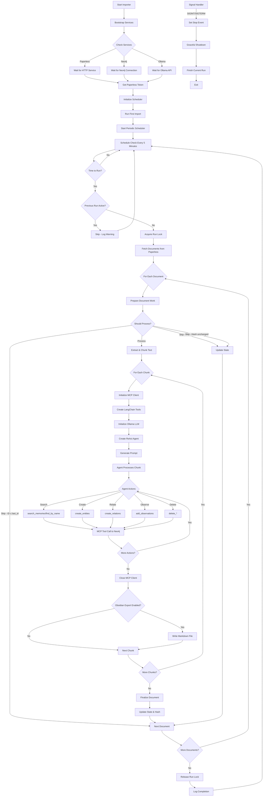

# Knowledge Builder

## Description

This project is an automated ETL pipeline: knowledge is extracted from documents OCR‑ed by Paperless‑ngx using the
Ollama LLM, then loaded into a Neo4j graph via the official Neo4j Memory MCP server. The loading is performed by a
LangChain ReAct Agent; tool calls are delegated to the LLM itself. Optionally, the raw text can also be exported to an
Obsidian vault. The importer includes a scheduler for periodic execution, graceful shutdown with no overlapping runs,
and verbose logging using loguru.

## ✨ Components

- Paperless‑ngx – OCR and storage for screenshots/documents
- paperless‑token (automated) – builds a tiny image from Paperless and automatically creates/gets the DRF API token,
  saving it to a shared file
- Ollama – local LLM (model: `llama31-kb`, temperature=0) built from a custom Dockerfile; the model is baked at image
  build time
- **Importer (Modular Architecture)** – A refactored, maintainable Python application with clean separation of concerns:
    - **Configuration Layer** – Centralized environment variable management
    - **Data Models** – Pydantic models for type safety and validation
    - **Utility Modules** – Text processing, JSON parsing, tool call handling
    - **Connectors** – Clean interfaces to Paperless API and Neo4j Memory MCP
    - **Processing Engine** – Document pipeline, AI agent orchestration, state management
    - **Services** – Bootstrap coordination and scheduled execution
- Neo4j – graph database + web UI (Browser)
- Memory MCP server – `mcp-neo4j-memory` invoked via STDIO by the importer (no separate service required)
- Scheduler – Executes the importer periodically (default: every 5 minutes), prevents overlapping runs
- Loguru Logging – Thread‑safe, rotating logs for better diagnostics (10 MB rotation)

## 📂 Directory Structure

```
neo4j-stack/
  docker-compose.yml      # Neo4j separate Compose
paperless/                # Paperless-ngx data & media
  data/
  media/
importer/
  src/                    # Modular Python application structure
    config.py             # Centralized configuration management
    models.py             # Data structures and Pydantic models
    main.py               # Application entry point
    utils/                # Utility modules
      __init__.py
      text_utils.py       # Text processing utilities
      json_parser.py      # JSON parsing and extraction
      tool_call_extractor.py  # Tool call extraction from LLM responses
      tool_call_normalizer.py # Tool call parameter normalization
    connectors/           # External service integrations
      __init__.py
      neo4j_connector.py  # Neo4j Memory MCP client management
      paperless_connector.py  # Paperless API integration
    processing/           # Core business logic
      __init__.py
      document_processor.py    # Main ETL pipeline orchestration
      agent_orchestrator.py    # AI agent processing with Neo4j
      state_manager.py         # Processing state and idempotency
    services/             # Supporting services
      __init__.py
      bootstrap.py        # Service availability and bootstrapping
      scheduler.py        # Scheduled execution coordination
  Dockerfile
ollama/
  Dockerfile              # builds Ollama image and pre-creates `llama31-kb`
  Modelfile               # FROM llama3.1:8b; PARAMETER temperature 0
paperless-token/
  Dockerfile              # minimal image derived from Paperless to create/get token
  entrypoint.sh           # waits for DB; runs manage.py drf_create_token; fallback script
bootstrap/
  get_token.py            # Django fallback (create/get DRF token)
  paperless_token.txt     # shared file: token written here
  token_init.sh           # legacy: not used with paperless-token image
data/
  state.json, importer.log, obsidian/
scripts/
  test_extract_entities.py
  test_tool_parsing.py
inbox/                    # mounted into Paperless consume directory
docker-compose.yml        # Paperless, paperless-token, Ollama, Importer
```

## ✅ Prerequisites

- Docker + Docker Compose
- Free ports: 7474 (Neo4j UI), 7687 (Neo4j Bolt), 8900 (Paperless UI), 11435 (host → Ollama:11434)
- GPU (for Ollama): enable GPU support in Docker (e.g., WSL2 + NVIDIA on Windows, nvidia‑container‑toolkit on Linux)
- Linux host mapping: Compose includes `extra_hosts: host.docker.internal:host-gateway`

## 🚀 Quickstart

1) Start Neo4j (separate compose)

```bash
# from project root
docker compose --env-file ./.env -f neo4j-stack/docker-compose.yml up -d
```

Neo4j UI: http://localhost:7474  
Login: user=`NEO4J_USERNAME`, pass=`NEO4J_PASSWORD`

2) Start the KB stack (Paperless, token bootstrap, Ollama, Importer)

```bash
docker compose up -d --build
```

3) Token bootstrap (automated)

The `paperless-token-init` job:
- waits for the Paperless DB file,
- runs `python3 manage.py drf_create_token $PAPERLESS_ADMIN_USER`,
- robustly extracts the token (fallback to Django helper if needed),
- writes it to `./bootstrap/paperless_token.txt`.

Check logs and the file:

```bash
docker compose logs -f paperless-token-init
cat ./bootstrap/paperless_token.txt
```

The importer reads this file automatically.

If the file contains `PENDING`, wait for migrations to finish and restart the token job:

```bash
docker compose restart paperless-token-init
```

## 🔧 Configuration (key envs)

- Root `.env` (shared)

```
NEO4J_USERNAME=neo4j
NEO4J_PASSWORD=<SET_IT>
PAPERLESS_INBOX=./inbox
PAPERLESS_ADMIN_PASSWORD=<SET_IT>
```

- Paperless (ensure admin creds align with your first run)

```
PAPERLESS_ADMIN_USER=admin
PAPERLESS_ADMIN_PASSWORD=<FROM_.env>
PAPERLESS_REDIS=redis://redis:6379
```

- Importer → Paperless & token file

```
PAPERLESS_URL=http://paperless:8000
PAPERLESS_TOKEN_FILE=/bootstrap/paperless_token.txt
```

- Neo4j (importer connection)

```
NEO4J_URL=bolt://host.docker.internal:7687
# Compatibility also supported by importer: NEO4J_URI, NEO4J_USER, NEO4J_PASS
```

- Ollama

```
# Model name created during the Ollama image build
OLLAMA_MODEL=llama31-kb
# Host access: http://127.0.0.1:11435 (container listens on http://ollama:11434)
```

- Importer runtime

```
MEMORY_MCP_CMD=/app/.venv/bin/mcp-neo4j-memory
STATE_PATH=/data/state.json
VAULT_DIR=/data/obsidian
SCHEDULE_TIME=5              # minutes
CHUNK_SIZE=5000
LOG_FILE=/data/importer.log
FORCE_REPROCESS=0            # set to 1 only for an initial full run/test
OBSIDIAN_EXPORT=0            # set to 1 to export chunk markdown files to VAULT_DIR
# Optional verbose logging controls (defaults shown in code)
LOG_CHUNK_FULL=0
LOG_CHUNK_PREVIEW_MAX=2000
LOG_TOOL_PREVIEW_MAX=1500
LOG_LLM_OUTPUT_MAX=4000
```

Notes:

- In the provided `docker-compose.yml`, `FORCE_REPROCESS` is set to `1` to exercise the pipeline on first startup;
  change it to `0` for incremental runs.
- The Memory MCP server (`mcp-neo4j-memory`) is launched by the importer via STDIO; no separate service is required.

## 📊 Program Operation

The Knowledge Builder follows a clear ETL (Extract, Transform, Load) pipeline with scheduled execution and graceful
shutdown. The diagram below shows startup, document processing, and shutdown, including idempotency checks and
chunk‑level processing.



### Key Operational Features

- Service Bootstrap: waits for Paperless, Neo4j, and Ollama to be available
- Token Management: automated by `paperless-token-init` (token at `bootstrap/paperless_token.txt`)
- Scheduled Execution: runs every 5 minutes (configurable) with overlap prevention
- Document Processing: state tracking avoids reprocessing unchanged documents
- Chunk Processing: splits large documents into manageable chunks (default 5000 chars)
- Agent‑Driven: LangChain ReAct agent makes autonomous decisions about Neo4j operations
- Evidence Linking: every touched/created entity is linked to a per‑chunk Evidence node
- Graceful Shutdown: responds to signals and finishes current work before exiting
- Thread Safety: uses locks to prevent concurrent runs and thread‑safe logging
- Error Resilience: continues processing even if individual documents fail

## 🏗️ Architecture Benefits

The importer has been refactored from a monolithic script into a well-structured, modular application:

### **Separation of Concerns**

- **Configuration**: All environment variables centralized in `config.py`
- **Data Models**: Type-safe Pydantic models in `models.py`
- **Utilities**: Reusable text, JSON, and tool processing functions
- **Connectors**: Clean abstractions for external service integration
- **Processing**: Core business logic separated by responsibility
- **Services**: Supporting functionality like bootstrapping and scheduling

### **Maintainability & Testing**

- **Smaller Modules**: Each file has a single, well-defined responsibility
- **Reduced Coupling**: Dependencies are explicit through imports
- **Enhanced Testability**: Individual components can be tested in isolation
- **Easier Extension**: New features can be added without modifying existing modules

### **Code Organization**

- **Logical Grouping**: Related functionality is packaged together
- **Clear Dependencies**: Import relationships are explicit and hierarchical
- **Consistent Structure**: Follows Python packaging best practices

## 🔍 Testing & Dev Aids

- Tail importer logs:

```bash
docker compose logs -f importer
```

- Run lightweight parser tests locally (no external services needed):

```bash
# from project root
python scripts/test_tool_parsing.py
python scripts/test_extract_entities.py
```

These scripts mock external deps and validate JSON/tool‑call parsing and entity extraction.

## 🧯 Troubleshooting

- `paperless_token.txt` shows PENDING

```bash
docker compose restart paperless-token-init
```

- No token logs: check the token service logs

```bash
docker compose logs -f paperless-token-init
```

- Ollama model not created: the model is baked into the custom image during build

```bash
docker compose build ollama && docker compose up -d ollama
```

- Neo4j not available: ensure `neo4j-stack` is running and `NEO4J_*` creds are correct

- Importer reprocesses endlessly: set `FORCE_REPROCESS=0` (it’s `1` in the sample compose for first‑run)

## 📜 License

MIT
