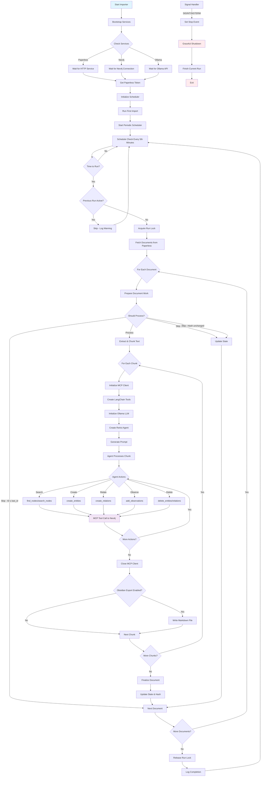

# Knowledge Builder

## Description

This project is an **automated ETL pipeline**: knowledge is extracted from documents OCR‑ed by Paperless‑ngx using the *
*Ollama** LLM, then loaded into a **Neo4j** graph via the official **Neo4j Memory MCP** server. The loading is performed
by a **LangChain Agent**; tool calls are **delegated to the LLM itself**. Optionally, the raw text can also be exported
to an **Obsidian** vault. The importer now includes a **scheduler** for periodic execution, **graceful shutdown with no
overlapping runs**, and **verbose logging** using `loguru`.

## ✨ Components

- **Paperless‑ngx** – OCR and storage for screenshots/documents
- **paperless‑token (new)** – builds a tiny image from Paperless and automatically creates/gets the DRF API token,
  saving it to a shared file
- **Ollama** – local LLM (`llama31-kb`, profile with temperature=0) built from a custom Dockerfile; the model is baked
  at image build time
- **Importer (LangChain Agent)** – Paperless → chunk → prompt → LLM → Memory MCP tool calls (STDIO) → Neo4j
- **Neo4j** – graph database + web UI (Browser)
- **Memory MCP server** – `mcp-neo4j-memory` (STDIO, full toolset)
- **Scheduler** – Executes the importer periodically (default: every 5 minutes), prevents overlapping runs
- **Loguru Logging** – Thread-safe, rotating logs for better diagnostics (10 MB rotation)

## 📂 Directory Structure

```
neo4j-stack/
  docker-compose.yml      # Neo4j separate Compose
paperless/                # Paperless-ngx data & media
  data/
  media/
importer/
  src/
    importer.py           # main Python script
  Dockerfile
ollama/
  Dockerfile              # builds Ollama image and pre-creates `llama31-kb`
  Modelfile               # FROM llama3.1:8b; PARAMETER temperature 0
paperless-token/
  Dockerfile              # minimal image derived from Paperless to create/get token
  entrypoint.sh           # waits for DB; runs manage.py drf_create_token; fallback script
bootstrap/
  get_token.py            # Django fallback (create/get DRF token)
  paperless_token.txt     # shared file: token written here
  token_init.sh           # legacy: not used with paperless-token image
data/
  state.json, importer.log, obsidian/
inbox/                    # mounted into Paperless consume directory
docker-compose.yml        # Paperless, paperless-token, Ollama, Importer
```

## ✅ Prerequisites

- Docker + Docker Compose
- Free ports: `7474`, `7687`, `8900`, `11435` (Ollama is exposed on 11435→11434)
- GPU (for Ollama): enable GPU support in Docker (e.g., WSL2 + NVIDIA on Windows, nvidia-container-toolkit on Linux)
- On Linux, Compose already includes: `extra_hosts: host.docker.internal:host-gateway`

## 🚀 Quickstart

1) Start Neo4j  
   Ensure `NEO4J_USERNAME` and `NEO4J_PASSWORD` from the root `.env` are used by `neo4j-stack`.

```bash
# from project root
docker compose --env-file ./.env -f neo4j-stack/docker-compose.yml up -d
```

Neo4j UI: http://localhost:7474  
Login: user=`NEO4J_USERNAME`, pass=`NEO4J_PASSWORD`

2) Start the KB stack (Paperless, token, Ollama, Importer)

```bash
docker compose up -d --build
```

3) Token bootstrap (automated)  
   The `paperless-token-init` service builds a tiny image from Paperless and:

- waits for the Paperless DB file,
- runs `python3 manage.py drf_create_token $PAPERLESS_ADMIN_USER`,
- robustly extracts the token, with fallback to a Django helper script,
- writes it to:

```
./bootstrap/paperless_token.txt
```

Check logs and the file:

```bash
docker compose logs -f paperless-token-init
cat ./bootstrap/paperless_token.txt
```

Importer reads this file automatically.

If the file contains `PENDING`, wait a bit for Paperless to finish migrations and restart the token job:

```bash
docker compose restart paperless-token-init
```

## 🔧 Configuration (key envs)

- Root .env (shared)

```
NEO4J_USERNAME=neo4j
NEO4J_PASSWORD=<SET IT>
PAPERLESS_INBOX=./inbox
```

- Paperless (Compose sets these by default; ensure admin cred matches your first-run)

```
PAPERLESS_ADMIN_USER=admin
PAPERLESS_ADMIN_PASSWORD=<DEFAULT_AS_IN_PAPERLESS>
PAPERLESS_REDIS=redis://redis:6379
```

- Importer → Paperless & token file

```
PAPERLESS_URL=http://paperless:8000
PAPERLESS_TOKEN_FILE=/bootstrap/paperless_token.txt
```

- Neo4j (importer connection)

```
NEO4J_URL=bolt://host.docker.internal:7687
# Compatibility also supported by importer: NEO4J_URI
```

- Ollama

```
# Model name created during the Ollama image build
OLLAMA_MODEL=llama31-kb
# Host access: http://127.0.0.1:11435 (container: http://ollama:11434)
```

- Importer

```
MEMORY_MCP_CMD=mcp-neo4j-memory
STATE_PATH=/data/state.json
VAULT_DIR=/data/obsidian
SCHEDULE_TIME=5
CHUNK_SIZE=5000
LOG_FILE=/data/importer.log
```

## 📊 Program Operation

This diagram provides a comprehensive view of the program's operation, showing the complete flow from startup through
document processing to shutdown. It captures all the key components and decision points in the system while maintaining
clarity about the ETL pipeline architecture.

The Knowledge Builder follows a clear ETL (Extract, Transform, Load) pipeline architecture with scheduled execution and
graceful shutdown capabilities. The following Mermaid diagram illustrates the complete operational flow:



### Key Operational Features

- **Service Bootstrap**: Waits for all required services (Paperless, Neo4j, Ollama) before starting
- **Token Management**: Automated by `paperless-token-init` (DRF token file at `bootstrap/paperless_token.txt`)
- **Scheduled Execution**: Runs every 5 minutes (configurable) with overlap prevention
- **Document Processing**: Tracks state to avoid reprocessing unchanged documents
- **Chunk Processing**: Splits large documents into manageable chunks (5000 chars default)
- **Agent-Driven**: LangChain ReAct agent makes autonomous decisions about Neo4j operations
- **Graceful Shutdown**: Responds to signals and finishes current work before exiting
- **Thread Safety**: Uses locks to prevent concurrent runs and thread-safe logging
- **Error Resilience**: Continues processing other documents even if individual ones fail

## 🔍 Testing

- **Logs**:

```bash
docker compose logs -f importer
```

On startup, you will see: *Neo4j available*, MCP *tools/list*, then the ReAct agent steps and tool calls.

## 🧯 Troubleshooting

- **`paperless_token.txt` = PENDING**  
  Paperless may still be migrating. Wait and then:

```bash
docker compose restart paperless-token-init
```

- **No token logs**  
  Check the token service logs:

```bash
docker compose logs -f paperless-token-init
```

- **Ollama model not created**  
  The model is baked into the custom image during build. Rebuild Ollama if needed:

```bash
docker compose build ollama && docker compose up -d ollama
```

- **Neo4j not available**  
  Ensure `neo4j-stack` is running and `NEO4J_*` creds are correct.

## 📜 License

MIT
