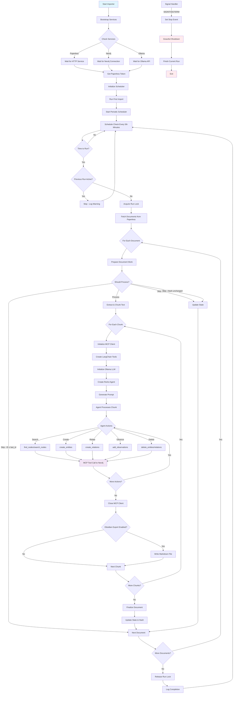

# Knowledge Builder

## Description

This project is an **automated ETL pipeline**: knowledge is extracted from documents OCR-ed by Paperless-ngx using the *
*Ollama** LLM, then loaded into a **Neo4j** graph via the official **Neo4j Memory MCP** server. The loading is performed
by a **LangChain Agent**; tool calls are **delegated to the LLM itself**. Optionally, the raw text can also be exported
to an **Obsidian** vault. The importer now includes a **scheduler** for periodic execution, **graceful shutdown with no
overlapping runs**, and **verbose logging** using `loguru`.

## ✨ Components

- **Paperless-ngx** – OCR and storage for screenshots/documents
- **Ollama** – local LLM (`llama31-kb`, *temperature=0* profile)
- **Importer (LangChain Agent)** – Paperless → chunk → prompt → LLM → Memory MCP tool calls (STDIO) → Neo4j
- **Neo4j** – graph database + web UI (Browser)
- **Memory MCP server** – `mcp-neo4j-memory` (STDIO, full toolset)
- **Scheduler** – Executes the importer periodically (default: every 5 minutes), prevents overlapping runs
- **Loguru Logging** – Thread-safe, rotating logs for better diagnostics (10 MB rotation)

## 📂 Directory Structure

    neo4j-stack/
      docker-compose.yml    # Neo4j separate Compose
    paperless/             # Paperless-ngx
        data/              # Paperless data
        media/             # Paperless media
    importer/
      src/                 # Python source code
        importer.py        # main Python script
      Dockerfile
    modelfile/Modelfile    # Ollama model profile (temperature=0)
    bootstrap/             # Paperless token goes here
    data/                  # state (state.json), Obsidian export
    docker-compose.yml     # Paperless, Ollama, Importer

## ✅ Prerequisites

- Docker + Docker Compose
- Free ports: `7474`, `7687`, `8900`, `11434`
- On Linux, Compose already includes: `extra_hosts: host.docker.internal:host-gateway`


## 🚀 Quickstart

1\) **Start Neo4j**  
Ensure `NEO4J_USERNAME` and `NEO4J_PASSWORD` from the root `.env` are used by `neo4j-stack`.  
**Recommended:**

   ```bash
   docker compose --env-file ./.env -f neo4j-stack/docker-compose.yml up -d
   ```

**Alternative:**

   ```bash
   cd neo4j-stack
   docker compose --env-file ../.env up -d
   ```

Neo4j UI: [http://localhost:7474](http://localhost:7474)  
Login: user=`NEO4J_USERNAME`, pass=`NEO4J_PASSWORD`

2\) **Start KB stack** (Paperless, Ollama, Importer)

   ```bash
   cd <PROJECT_ROOT>
   docker compose up -d --build
   ```

3\) **Paperless token**  
On first start, `paperless-token-init` requests an API token. If it fails, it creates:

   ```bash
   ./bootstrap/paperless_token.txt  # content: PENDING
   ```

Open Paperless UI ([http://localhost:8900](http://localhost:8900)) → *My Profile → Generate token*  
Enter the token in the file. The Importer will detect it within 5 seconds and start.

## 🔧 Configuration (key envs)

- Root .env (shared)

      NEO4J_USERNAME=neo4j
      NEO4J_PASSWORD=<SET IT>

- Paperless

      PAPERLESS_ADMIN_USER=admin
      PAPERLESS_ADMIN_PASSWORD=<DEFAULT_AS_IN_PAPERLESS> # (first start)
      PAPERLESS_URL=http://paperless:8000
      PAPERLESS_TOKEN_FILE=/bootstrap/paperless_token.txt

- Neo4j (importer connection)

      NEO4J_URL=bolt://host.docker.internal:7687
      # Compatibility also supported by importer: NEO4J_URI

- Ollama

      # Profile name created by model init job
      OLLAMA_MODEL=llama31-kb

- Importer

      MEMORY_MCP_CMD=mcp-neo4j-memory
      STATE_PATH=/data/state.json
      VAULT_DIR=/data/obsidian
      OBSIDIAN_EXPORT=true
      SCHEDULE_TIME=5
      CHUNK_SIZE=5000
      LOG_FILE=/data/importer.log

- **Importer / pyproject.toml dependencies** (add if missing)

      httpx
      pydantic
      langchain
      langchain-community
      mcp-neo4j-memory
      schedule
      loguru

## 📊 Program Operation

This diagram provides a comprehensive view of the program's operation, showing the complete flow from startup through
document processing to shutdown. It captures all the key components and decision points in the system while maintaining
clarity about the ETL pipeline architecture.

The Knowledge Builder follows a clear ETL (Extract, Transform, Load) pipeline architecture with scheduled execution and
graceful shutdown capabilities. The following Mermaid diagram illustrates the complete operational flow:



### Key Operational Features:

- **Service Bootstrap**: Waits for all required services (Paperless, Neo4j, Ollama) before starting
- **Token Management**: Handles Paperless API token from file with automatic detection
- **Scheduled Execution**: Runs every 5 minutes (configurable) with overlap prevention
- **Document Processing**: Tracks state to avoid reprocessing unchanged documents
- **Chunk Processing**: Splits large documents into manageable chunks (5000 chars default)
- **Agent-Driven**: LangChain ReAct agent makes autonomous decisions about Neo4j operations
- **Graceful Shutdown**: Responds to signals and finishes current work before exiting
- **Thread Safety**: Uses locks to prevent concurrent runs and thread-safe logging
- **Error Resilience**: Continues processing other documents even if individual ones fail

The system maintains idempotency through document hashing and state tracking, ensuring efficient incremental processing
of new content.

## 🧠 How the Importer Works

1. Paperless API: list new/modified documents
2. Extract text, chunk into 5000 characters
3. **User-prompt** (no system-prompt) → Ollama (`llama31-kb`)
4. The LLM **directly** calls Memory MCP tools (LangChain StructuredTool wrap):
    - `find_nodes`, `search_nodes`, `read_graph`
    - `create_entities`, `delete_entities`
    - `create_relations`, `delete_relations`
    - `add_observations`, `delete_observations`
5. For every created item, pass: `source_id`, `chunk_id`, `source_url`
6. Optional: Obsidian export if enabled (`data/obsidian/`)
7. **Scheduler**: Runs the importer periodically (default: every 5 minutes) with no overlapping runs
8. **Logging**: Logs are written to `importer.log` (rotation after 10 MB, retention 10 days, thread-safe). You can set
   `LOG_FILE` (default `/data/importer.log`).
9. **Graceful shutdown**: SIGINT/SIGTERM stop scheduling and finish the current run cleanly

## 🔍 Testing

- **Logs**:

      docker compose logs -f importer

  On startup, you will see: *Neo4j available*, MCP *tools/list*, then the ReAct agent steps and tool calls.

- **MCP client binary** in the container:

      docker exec -it importer bash
      which mcp-neo4j-memory
      NEO4J_URL="bolt://host.docker.internal:7687" \
      NEO4J_USERNAME="neo4j" \
      NEO4J_PASSWORD="testpass" \
      mcp-neo4j-memory

## 🧯 Troubleshooting

- **`paperless_token.txt` = PENDING**  
  Generate a new token in the Paperless UI and write it to the file. The Importer will automatically proceed.

- **Neo4j not available**  
  Check if `neo4j-stack` is running. On Linux, `extra_hosts: host.docker.internal:host-gateway` is important.

- **Ollama model not created**  
  Check the `ollama-model-init` logs; the profile name is `llama31-kb`.

- **Tool errors / missing tools**  
  The log line *Available MCP tools* shows the tools advertised by the server. If there is a version mismatch, update
  the `mcp-neo4j-memory` package.

## 📜 License

MIT


