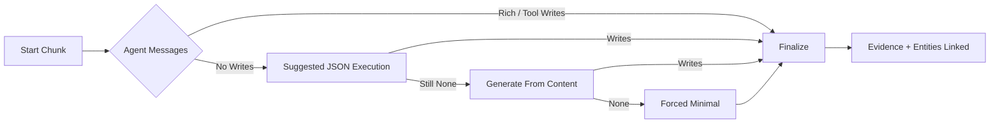

# Agent Orchestrator Design (Refactored, Modular)

Last updated: 2025-10-12

## Overview

Structured ingestion of document chunks into the Neo4j knowledge graph is coordinated by a **set of focused modules** instead of a single monolith:

* `agent_orchestrator.py` – Staged control flow, evidence linking, logging, public thin wrappers
* `agent_execution.py` – Async agent invocation, timeout handling, message parsing, suggested tool execution ordering
* `fallback_strategies.py` – Heuristic + forced‑minimal entity/observation generation
* `agent_prompts.py` – Prompt template constant
* `json_utils.py` (+ `ToolCallExtractor`) – High‑resilience JSON / tool call extraction

Core objectives remain:
* Bounded per‑chunk runtime (timeouts + ordered fallbacks)
* High observability (uniform stage logs, truncated previews)
* Deterministic evidence nodes for traceability
* Progressive enhancement: Agent → AI‑suggested calls → Generated heuristics → Forced minimal
* Testability via slim public wrappers and separable modules (SRP & SOLID friendly)

## Processing Stages (in `AgentOrchestrator.process_chunk` )

1. Primary (`_stage_primary_prompt`) – Build prompt, invoke async ReAct agent (`run_agent_with_timeout`) and log last AI message.
2. Suggested (`_stage_execute_ai_suggestions`) – If no writes yet, parse inline JSON tool call blocks (via `ToolCallExtractor`), execute them.
3. Generate (`_stage_generate_calls_from_content`) – If still no writes, derive entities from AI content or raw text heuristics (delegates to `fallback_strategies.generate_tool_calls_from_content`).
4. Forced (`_stage_force_minimal`) – Guarantee a minimal semantic footprint (evidence + 1–N simple entities + observations) using `force_minimal_write`.
5. Finalize (`_stage_finalize`) – De‑duplicate touched entities, create evidence (if not already), link them, and retry deferred relations (deduped).

Only the minimal necessary stages run: once a stage achieves a successful write ( `wrote=True` ), subsequent enrichment stages are skipped except Finalize.

## Timeout Execution Model

Two layers exist:
* `agent_execution.run_agent_with_timeout` – The canonical implementation: `asyncio.run` + `asyncio.wait_for`, robust loop fallback and rich error logging.
* `AgentOrchestrator._run_with_timeout` – Thin backward‑compatibility shim retained for tests that monkey‑patch a `run_agent` coroutine. It delegates to the shared implementation unless a patched async `run_agent` attribute is present.

Timeouts yield an empty message list, triggering heuristic progression instead of bubbling exceptions.

## Helper Abstractions (Current Canonical Set)

| Purpose | Helper | Notes |
|---------|--------|-------|
| Evidence naming | `_make_evidence_name(source_id, chunk_id)` | Format: `Evidence <SOURCE_ID>-<CHUNK_ID>` |
| Evidence payload | `_build_evidence_entity(source_id, chunk_id, source_url)` | Adds source metadata in observations list |
| Tool invocation | `_invoke_tool(name, params)` | Central logging + success detection |
| Heuristic entity candidates | `fallback_strategies.collect_capitalized_entities` | Moved out of orchestrator (was previously internal) |
| Evidence linking | `_link_entities_to_evidence(evidence_name, entity_names)` | Uses `create_relations` tool |
| Context observation | `_add_context_observation(entity_name, text, prefix)` | Truncates to configured limit |
| Touched name extraction | `_collect_touched_names(tool_name, params)` | Normalizes names from tool arguments |
| Relation retry normalization | `_normalize_relation_for_retry` / `_relation_key` | Deduplicates before final retry |

Public wrappers ( `make_evidence_name` , `build_evidence_entity` , `collect_capitalized_entities` , `invoke_tool_safe` , `add_context_observation` ) keep tests stable without exposing internal invariants directly.

Deprecated / Removed:
* `_collect_capitalized_entities` (old private) – superseded by exported function in `fallback_strategies`.
* Large inline JSON parsing helpers – replaced by consolidated `json_utils` + `ToolCallExtractor` resilient strategy.

## Fallback Strategy (Resilience Ladder)

1. Agent Tool Calls – Ideal rich graph updates.
2. Suggested Call Execution – Executes tool JSON the agent embedded in its last message.
3. Generated Calls From Content – Derive entities/relations heuristically from AI content + raw text.
4. Forced Minimal – Ensure at least: Evidence node, 1–N lightweight entities, observations, and evidence relations.

This guarantees every processed chunk produces:
* A deterministic Evidence node (`Evidence <SOURCE_ID>-<CHUNK_ID>`)
* At least one semantic anchor (entity name and/or observation)
* Relations tying entities to the evidence for future enrichment

### Ladder Diagram

## Logging & Observability

* Consistent stage prefix formatting via `_log_stage` / `_log_stage_warn`.
* Last AI message content always logged (truncated) for transparency.
* Every tool call funnels through `_invoke_tool` (central intent/result logging) or `agent_execution.invoke_and_collect` (suggested calls path).
* Heuristic / forced paths emit explicit `[agent] generated` / `forced` prefixes to distinguish origin.

## Exception Handling

* Narrow, explicit exception classes where predictable (argument/type/timeout).
* Broad catch only at `process_chunk` boundary to trigger emergency forced minimal fallback without silent loss.
* Relation retry failures are warnings, not fatal.

## Testability

Tests rely on:
* Presence of `_run_with_timeout` symbol for monkey‑patching.
* Deterministic evidence naming scheme.
* Stable ordering of tool execution (observations → entities → other → relations) enforced in `agent_execution.order_tool_calls`.
* Heuristic functions exported from `fallback_strategies` for direct unit coverage.

## Data & Naming Conventions (Current)

* Evidence node name: `Evidence <SOURCE_ID>-<CHUNK_ID>`
* Relation keys use active voice per Neo4j Memory MCP expectations.
* Observation payloads truncated using `Config.LOG_TOOL_PREVIEW_MAX` / local helper limits to prevent bloat.

## Extensibility Guidance

1. Put new async agent mechanics in `agent_execution.py`.
2. Keep heuristic-only logic in `fallback_strategies.py`.
3. Add a new stage only if it introduces a distinct decision boundary; otherwise enrich an existing stage.
4. Reuse `_invoke_tool` instead of calling the connector directly—preserves uniform logging & success detection.
5. Update docs + ADR when adding or changing a stage.

## Performance Notes

* Early exit after first successful write prevents unnecessary heuristic passes.
* Lightweight regex heuristics avoid secondary LLM calls.
* Deduped relation retry prevents redundant graph edges.

## Future Enhancements

* Adaptive timeouts by chunk size or historical agent latency.
* Prometheus metrics for stage durations & fallback counts.
* Cross‑chunk entity consolidation / alias resolution.
* Re‑enrichment pipeline targeting minimally populated evidence nodes.

## Summary

The orchestrator is now a modular, low‑complexity pipeline: clear stage boundaries, centralized logging, deterministic fallbacks, and isolated heuristics. This architecture reduces risk, simplifies testing, and prepares the system for incremental capability upgrades without re‑introducing monolith debt.
