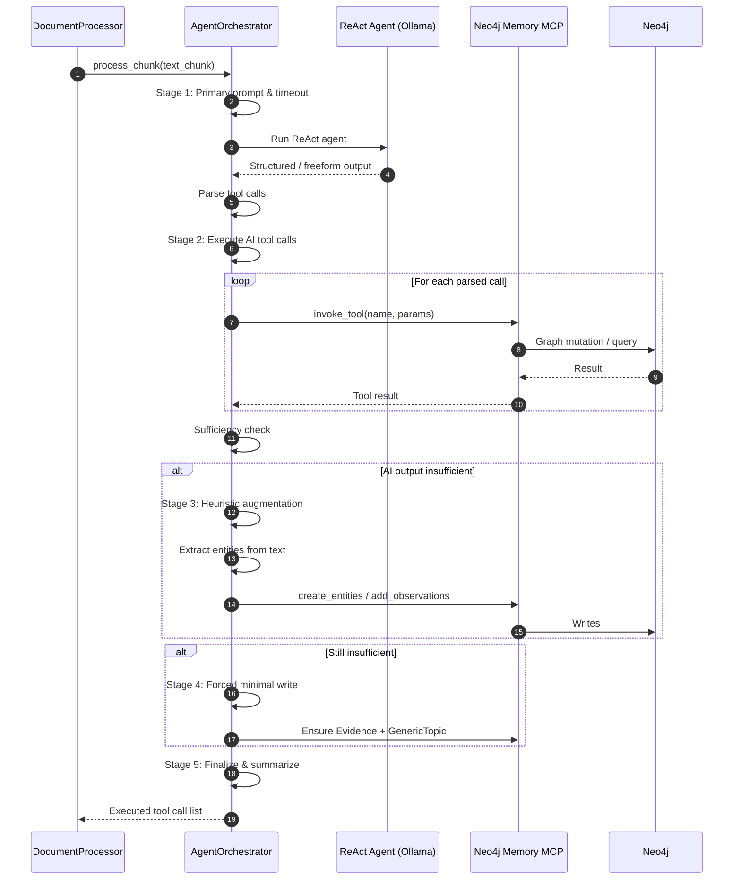

# Knowledge Builder Docs

This project is WIP, contributors are welcome.

## High-Level Flow

## Key Guarantees

* Deterministic Evidence node per chunk
* Progressive enrichment ladder (AI → heuristic → forced)
* Bounded agent time (single timeout wrapper)
* Centralized logging & tool call execution

## More Details

See the full design in `agent_orchestrator.md` .
