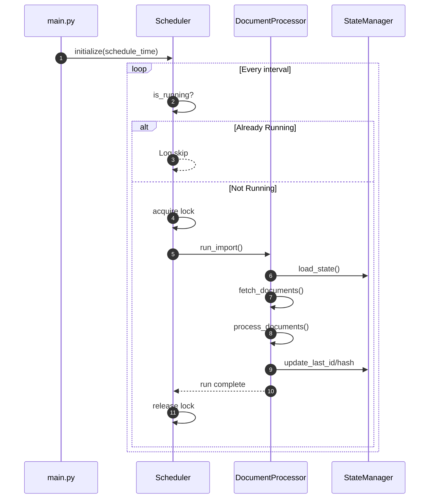

# Scheduler & Run Coordination

The scheduler ensures periodic, non-overlapping ingestion runs with graceful shutdown semantics.

## Responsibilities

* Periodic trigger (default every 5 minutes via `schedule` library)
* Overlap prevention via in-process run lock
* Early exit if stop event set (signal handler)
* Delegation to Document Processor for actual ETL work

## Sequence

## Locking Strategy

* Simple in-memory boolean / threading. Lock (sufficient for single-process container)
* Prevents scheduler drift causing overlapping long-running runs

## Shutdown

* Signal handler sets a stop event
* Scheduler loop checks stop flag before starting a new cycle
* In-flight document/chunk completes before process exits

## Future Enhancements

* External distributed lock (e.g., Redis) for horizontal scaling
* Metrics around run duration & skipped intervals
* Backoff / jitter to avoid thundering herd if scaled
